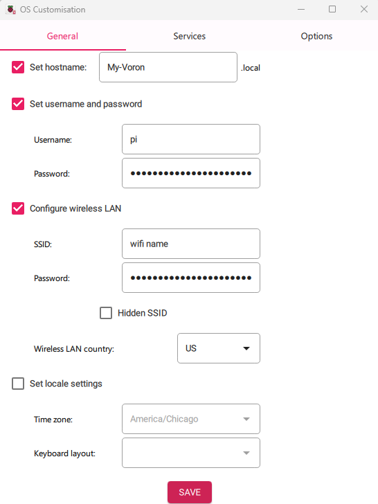
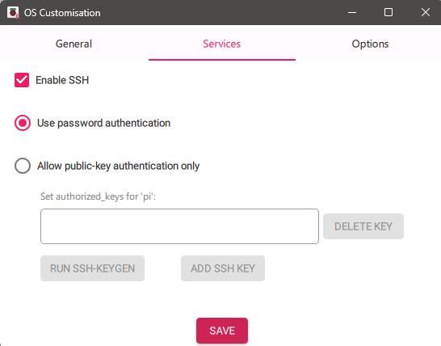

# Installing Mainsail

The recommended way to install Mainsail on a Raspberry Pi is to use [MainsailOS](#mainsailos), a pre-packaged disk image. If you are building a custom configuration, you may need to skip these instructions and install Mainsail [manually](#mainsail-manual-installation).

## MainsailOS

To install Mainsail on a Raspberry Pi:

1. Download and install [pi-imager](https://www.raspberrypi.com/software/)
2. Click "Choose OS" and scroll down to "Other specific-purpose OS".
3. Select "3D Printing" and choose "Mainsail OS".
4. Choose your SD Card.
5. Click `NEXT`
6. Click the `EDIT SETINGS` button

on the General tab you can give your printer a host name, you can also change the default username and password for your raspberry pi, lastly you can enter your WIFI credentials
    

  
on the Services tab be sure to tick the "enable SSH" box
    

8. When finished with the settings, click `SAVE` and then click `YES` when asked if you would like to apply customized OS settings
9. Double check that your target device SD card is correct and then Click on `YES`. *THIS WILL DESTROY ALL DATA ON YOUR CARD*. 
  
    _note: It is a good idea to use a premium microSD card from a reputable manufacturer such as Sandisk, Kingston or Samsung. Low end cards will often fail quickly when used in this application_

10. Make sure that your MCU(s) is connected to your pi. If you will be using wired networking, also make sure your ethernet cable is connected.
11. Insert the microSD card into your Pi, and power on the Pi.
12. Find your Pi on the network, and ssh into it (using PuTTY on Windows or the terminal on MacOS)  
   The default username is `pi` and the password is `raspberry`.
    * If your network supports bonjour, the pi should show up as `mainsailos.local`
    * If your network automatically assigns DNS hostnames, it may simply show up as `mainsailos`
    * Failing these two options, you may need to check your router's DHCP server, and find out what IP address as been assigned to the device.

### LCD User Interface

The MainsailOS does not include KlipperScreen which is needed for the LCD interface.  This can be installed using Kiauh by following instructions here: [Klipper Screen Install](https://klipperscreen.readthedocs.io/en/latest/Installation/#setup).

### Software Update

As soon as you have MainsailOS loaded, it is highly recommended that you make sure all the software is up to date.  (At times, the downloaded image file contains fairly out of date software.)

1. Access Mainsail through a web browser, using whatever IP or hostname you found above.  
(Note, you will see some errors regarding the non-configured state of your printer. These can be ignored… for now)
2. Click the "Machine" button on the left side of the screen
3. In the "Update Manager" panel, click the refresh button
4. Click the "Update" button for each component that needs updating.

### Next: [Firmware Flashing](./index.md#firmware-flashing)

## Mainsail Manual Installation

The Mainsail manual installation process is documented in [the Mainsail docs](https://docs.mainsail.xyz/setup/manual-setup).

---

### Back: [Software Installation](./index.md)
